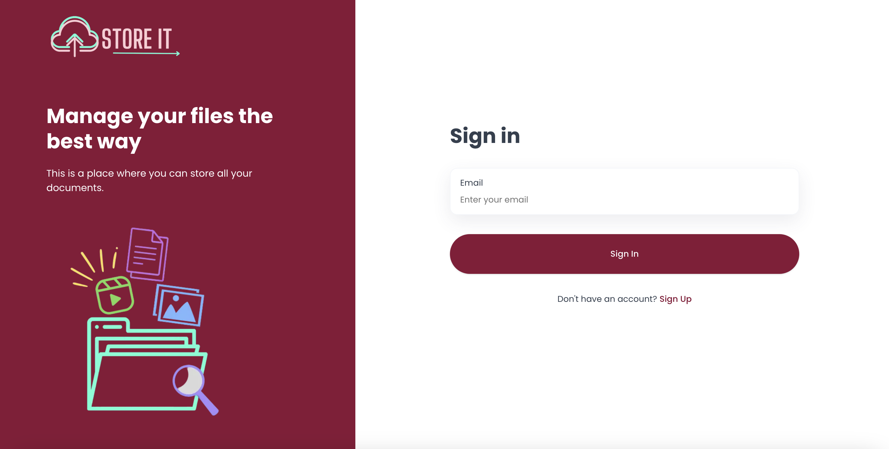

# Store It

Store-it is a cloud-based file storage application similar to Google Drive. It allows users to securely store, manage, and access their documents online.


## Features

- Secure file storage
- User authentication (Sign In/Sign Up)
- Intuitive user interface
- File management system
- Responsive design for mobile and desktop

## Technologies Used

- **Next.js** - React framework for server-side rendering
- **Appwrite** - Backend-as-a-service for authentication and database
- **Tailwind CSS** - Utility-first CSS framework for styling
- **TypeScript** - Strongly typed JavaScript for better development experience

## Installation

To set up the project locally, follow these steps:

1. Clone the repository:
   ```sh
   git clone https://github.com/your-repository/store-it.git
   ```
2. Navigate to the project folder:
   ```sh
   cd store-it
   ```
3. Install dependencies:
   ```sh
   npm install  # or yarn install / bun install
   ```
4. Create a `.env` file and add your Appwrite configurations:
   ```env
   NEXT_PUBLIC_APPWRITE_ENDPOINT=your-appwrite-endpoint
   NEXT_PUBLIC_APPWRITE_PROJECT_ID=your-project-id
   NEXT_PUBLIC_APPWRITE_DATABASE_ID=your-database-id
   NEXT_PUBLIC_APPWRITE_USERS_COLLECTION_ID=your-users-collection-id
   ```
5. Run the development server:
   ```sh
   npm run dev  # or yarn dev / bun run dev
   ```
6. Open [http://localhost:3000](http://localhost:3000) in your browser.

## Usage

- **Sign Up / Sign In** - Create an account or log in to access your files.
- **Upload Files** - Store your documents securely.
- **Manage Files** - Organize and retrieve your stored files.

## Deployment

This project can be deployed using platforms like Vercel, Netlify, or your preferred cloud provider.

## Contribution

Feel free to contribute by submitting pull requests or opening issues.

## License

This project is licensed under the MIT License.

---

🚀 **Store-it** - Manage your files the best way!
